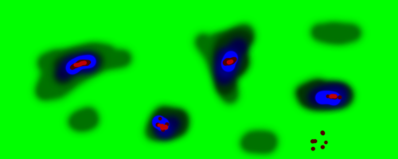
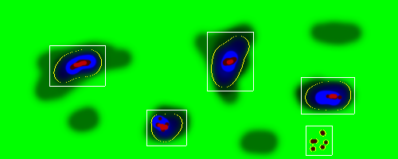

# Conture-detect

This project is not a general perpose conture-detection. The source image is considered a heatmap. The color scale of the headmap is utilized to describe a continues value, and a threshold describes the figures to detect.

## Example
Source:

Result:

